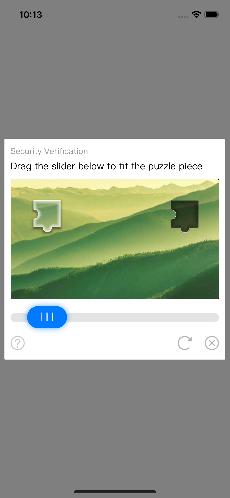

# TencentCaptchaFunction


## Example

To run the example project, clone the repo, and run `pod install` from the Example directory first.

## Requirements

## Installation

TencentCaptchaFunction is available through [CocoaPods](https://cocoapods.org). To install
it, simply add the following line to your Podfile:

```ruby
pod 'TencentCaptchaFunction'
```

# Usage

Import the framework:
```
#import <TencentCaptchaFunction/TencentCaptchaViewController.h>
```

Then, initiaze the instance of TencentCaptchaFunction and set the property of appId, you can register an account in Tencent Open Developer Platform and request for a appId:

#### Objective C:


```
TencentCaptchaViewController *controller = [[TencentCaptchaViewController alloc] initWithAppId:@"your appid" enableDarkMode:YES];
controller.modalPresentationStyle = UIModalPresentationOverFullScreen;
    controller.onLoaded = ^(NSDictionary * _Nonnull data) {
        NSDictionary<NSString *, id> *eventData = @{
            @"method": @"onLoaded",
            @"data": data,
        };
        NSLog(@"%@", eventData);
    };
    controller.onSuccess = ^(NSDictionary * _Nonnull data) {
        NSDictionary<NSString *, id> *eventData = @{
            @"method": @"onSuccess",
            @"data": data,
        };
        NSLog(@"%@", eventData);
    };
    controller.onFail = ^(NSDictionary * _Nonnull data) {
        NSDictionary<NSString *, id> *eventData = @{
            @"method": @"onFail",
            @"data": data,
        };
        NSLog(@"%@", eventData);
    };
```

#### Swift:

```
let controller = TencentCaptchaViewController(appId: "your appid", enableDarkMode: true)
controller.modalPresentationStyle = UIModalPresentationStyle.overFullScreen
    controller.onLoaded = { data in
        print(data)
    }
    controller.onSuccess = { data in
        print(data)
    }
    controller.onFail = { [weak self] data in
        print(data)
    }
```

and you will the image like this:  



## Author

ninjaKID, nguyenthuongthongcm@gmail.com

## Reference

https://cloud.tencent.com/document/product/1110/36841

https://github.com/BaconTimes/TencentCaptchaSDK

https://github.com/leanflutter/flutter_tencent_captcha

## License

TencentCaptchaFunction is available under the MIT license. See the LICENSE file for more info.
